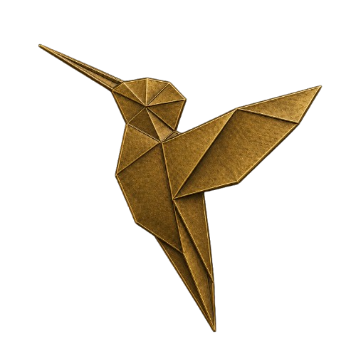

<p align="center">
  
</p>

# fieldnotes

Writing and evidence: agent systems, models, evaluation and computational
biology.

Published at <https://evoclock.github.io/fieldnotes/>.

## Layout

| Path | What |
|---|---|
| `index.html` | the index, grouped by theme with a latest-first view |
| `articles/` | long-form pieces |
| `publications/` | project briefs, technical reports and slides |
| `evals/` | evaluation write-ups, and the script that renders their thumbnails |
| `diagrams/` | figures, with the sources that generate them |
| `assets/` | the marks, in three copper alloys: sentoku, shibuichi and yamagane |

Thumbnails and diagrams are generated rather than drawn by hand. Regenerate
them with:

```bash
python3 evals/thumbnails.py
python3 diagrams/00_workforce_overview.py
```

An entry can belong to more than one theme, so some appear twice on the index.
