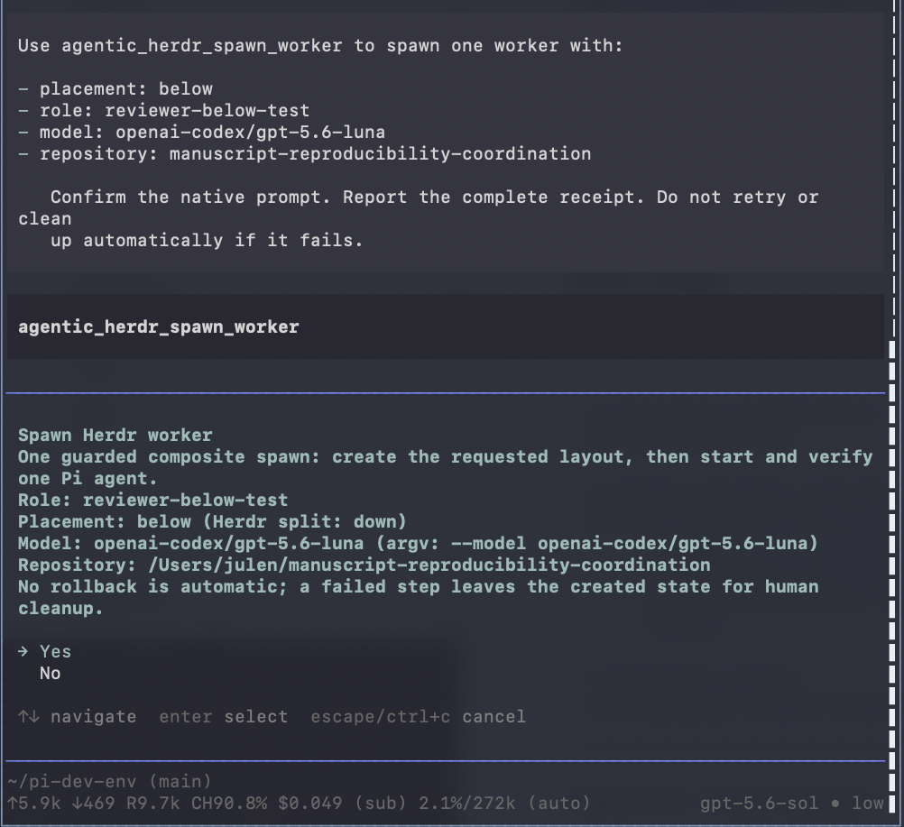
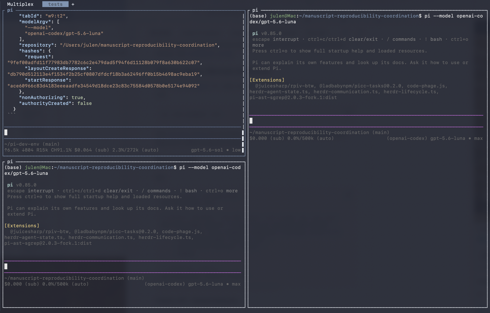
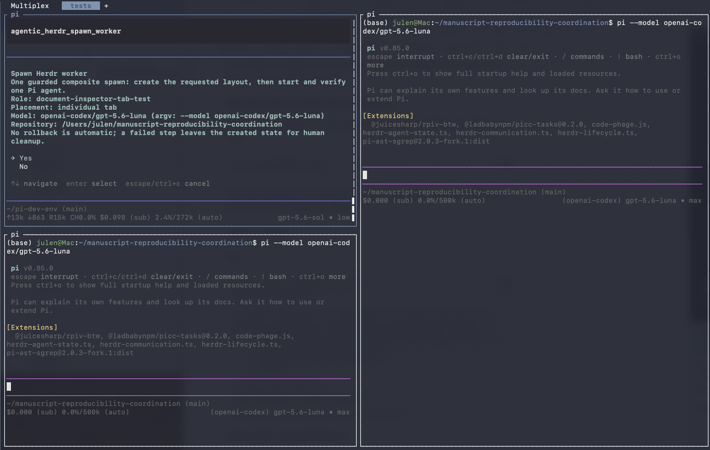
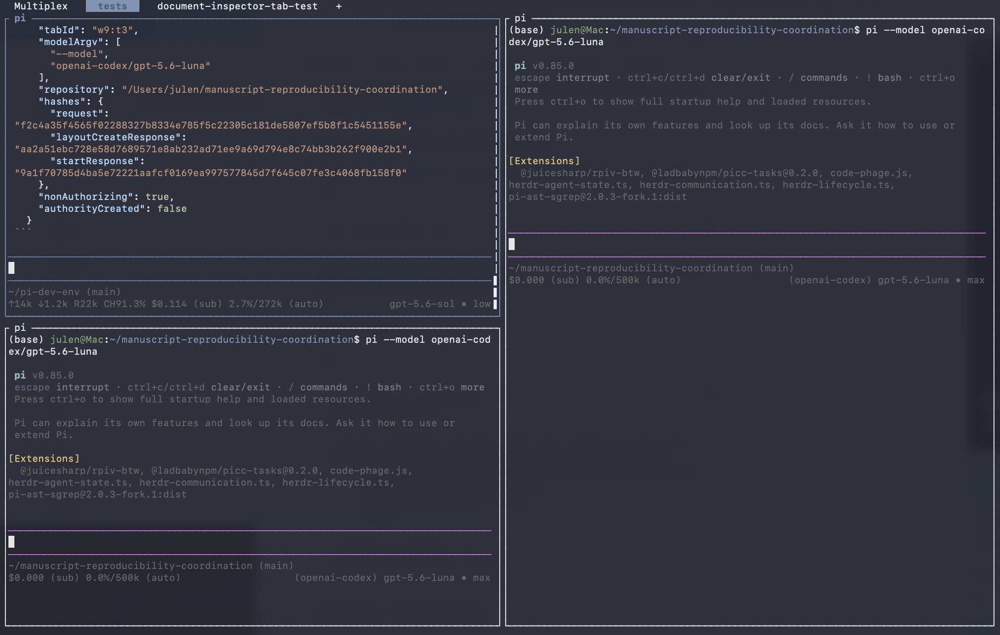

# Dispatching a Multi-Model Workforce from Anywhere

**How the Agentic Driver extension set uses Herdr and Pi to route tasks by role, model and machine, and keep persistent sessions within reach from a laptop, phone or remote terminal.**

*Julen Gamboa · 5 September 2026*

I have been building Agentic Driver as a set of extensions for coordinating coding agents rather than as another agent runtime. The aim is to use the tools that already work, expose the useful parts to Pi, and make it easier to send the right task to the right model without turning every session into a collection of shell commands.

Herdr is one of those tools. It already provides persistent terminal workspaces, tabs, panes, agent detection and an automation interface. Pi already provides the model harness, installed model roster and extension system. Agentic Driver connects those pieces so that I can ask for a worker in natural language, choose its role and model, place it where I want it, and communicate with it afterwards.

The larger goal is a multi-model workforce that I can operate locally or remotely. I want to be able to open an SSH client on my phone, connect over Tailscale, inspect the sessions running on another machine, use local models over ssh, and dispatch agents for different jobs without rebuilding the workspace each time.

## What I want to be able to ask for

A request can be as simple as:

> Create a reviewer in a pane to the right, use GPT-5.6 Luna, and run it in the manuscript coordination repository.

Or:

> Start a document inspector in its own tab, use a model from my installed roster, and ask it to check the source material against the draft.

The request carries four practical choices:

- **where the worker should run:** in a pane to the right, a pane below, or its own tab;
- **what role it should have:** reviewer, implementer, document inspector, pentester, or another useful label;
- **which model should take the task:** selected from the models installed in the active Pi profile; and
- **which repository it should work in:** selected from the repositories I have explicitly configured for worker use.

The role name is also the visible Herdr label. That matters once several workers are open. A pane called `reviewer` or a tab called `document-inspector` is easier to navigate than a row of indistinguishable agent sessions.


*One natural-language request creates a labelled reviewer in a pane to the right and starts the selected Pi model in the target repository.*

## Herdr provides the workspace and agent primitives

Herdr already knows how to:

- split panes and create tabs;
- start a supported coding agent in an available shell;
- assign a unique name to a live agent;
- detect whether an agent is working, idle, done, blocked or unknown;
- send an agent a prompt;
- wait for it to settle; and
- read its output.

Its native command sequence is straightforward:

```sh
created=$(herdr pane split --current --direction right \
  --cwd ~/project --no-focus)
pane_id=$(printf '%s\n' "$created" | jq -r '.result.pane.pane_id')

herdr agent start reviewer \
  --kind pi \
  --pane "$pane_id" \
  --timeout 120000 \
  -- \
  --model openai-codex/gpt-5.6-luna

herdr agent prompt reviewer \
  "Review the current diff" \
  --wait \
  --timeout 120000

herdr agent read reviewer \
  --source recent-unwrapped \
  --lines 120
```

Any shell-capable harness can use these commands. Codex, Pi, etc or another agent can be asked in natural language to split a pane, start a worker, prompt it and collect the result. The harness interprets the request; Herdr performs the terminal and agent operations.

Agentic Driver does not reimplement that machinery. It exposes a smaller Pi-facing interface for the operations I want agents to perform routinely.

## What the Agentic Driver extensions add

The lifecycle extension turns worker creation into one constrained tool call. It accepts a placement, role, model and repository, shows a native confirmation, and then uses Herdr's own commands to create and verify the worker.

The communication extension provides a similarly narrow route for subsequent interaction. It can list configured workers, inspect one, send one prompt, wait for a terminal lifecycle state and read a bounded response.

Together, the extensions add:

- natural-language access from a Pi session;
- model selection from Pi's merged installed model roster;
- role labels that remain visible in Herdr;
- trusted-repository checks;
- protection for reserved coordinator names;
- native confirmation before creating a pane, tab or agent;
- fixed command arguments without a general shell surface;
- bounded observations and explicit partial results;
- no hidden retries; and
- no automatic deletion when only part of an operation succeeds.

This is intentionally narrower than handing an agent unrestricted control of the Herdr CLI. The extension is useful because it makes the common operation easy while keeping the choices visible.

## Placing workers according to the job

The placement is part of how I organise work.

A reviewer can sit to the right of the coordinator so that both sessions remain visible. An implementer can run below while I keep the main conversation in the larger pane. A document inspector can have its own tab when it needs more screen space or when I do not need to watch every step.



*The confirmation shows the role, placement, selected model and target repository before Herdr changes the layout.*



*The `below` placement becomes Herdr's native `down` split direction.*

A separate tab uses the same request shape:





*The tab label makes the worker's purpose visible even when several sessions are running.*

## Task and model routing

Different models are useful for different jobs. A fast local model may be enough for repository inspection or a tightly scoped implementation. A larger reasoning model may be better suited to architecture review. A model with a long context window may be the better choice for comparing a manuscript against a large collection of source documents.

The model roster should therefore be part of dispatch rather than a global decision made once at startup. Agentic Driver resolves the requested model against the active Pi profile instead of maintaining its own hard-coded model list. If I add or remove a model from Pi, the worker interface follows the same roster.

Role, task and model can then be selected together:

- an **implementer** receives a bounded coding task and an efficient coding model;
- a **reviewer** receives the resulting diff and a model chosen for critical review;
- a **document inspector** receives source material and a long-context model;
- a **pentester** receives a threat-focused prompt and an appropriate repository view; and
- a **coordinator** remains separate from those worker identities.

This is the beginning of practical task/model routing: not an abstract router scoring models in isolation, but a working interface for choosing who should do what, where and with which model.

## Keeping useful models warm

Persistent sessions also help with cache management. Starting every task from a cold process wastes time, especially when several jobs repeatedly use the same model, repository context or tool configuration.

Herdr keeps the terminal sessions available. Pi keeps the model sessions running. On local inference machines, keeping selected workers alive can also help keep frequently used models warm rather than repeatedly loading and unloading them between small tasks.

That does not mean every model should remain resident forever. The useful pattern is to keep a small set of active seats for current work: perhaps an implementer, a reviewer and a document-focused worker. Their role labels make those seats easy to find, and the model choice remains explicit.

## Remote control over Tailscale and SSH

The same arrangement is useful away from the desk. Herdr is a persistent multiplexer rather than a window tied to one local display. The machines can remain connected through Tailscale, and I can attach through an SSH client from a laptop, tablet or phone.

That makes it possible to:

- inspect which agents are running on each machine;
- open the coordinator session remotely;
- dispatch a new role-labelled worker;
- choose a model available on that machine;
- send or refine a task;
- check whether the worker is active, idle or blocked; and
- read the result without reconstructing the local desktop layout.

The machines can have different jobs. How I currently use it is as follows: I run a mac mini as an interactive control plane. A Linux workstation with substantial RAM, GPU and enough cores is my bioinformatics/computational genomics workhorse. A DGX Spark host my local models and provides a CUDA environment where I can also fine tune some models. The same basic worker vocabulary—role, model, task, repository and placement—can be used across them. When I am not at my desk I user termius (moshi is good too) as an ssh client and then simply connect and have access to the same sessions I have on any of my machines with more control and less latency than Claude Code remote-control or Codex affords me, I can have a quick peek to see how things are going, troubleshoot issues or dispatch new tasks, etc.

The point is not remote automation for its own sake. It is continuity. Work can keep running on the machine suited to it, while the human retains a practical way to inspect and steer that work from another device.

## Communication after dispatch

Creating a worker is only the first half of the workflow. The `herdr-communication.ts` extension handles the next step without opening a general terminal-control surface.

A coordinator can:

1. list the configured worker roles;
2. inspect the selected live agent;
3. send one bounded prompt;
4. wait for a defined lifecycle state; and
5. read the resulting output.

Reports can use role-specific markers such as:

```text
[REVIEWER_REPORT_BEGIN]
...
[REVIEWER_REPORT_END]
```

The markers make a requested report easier to extract from surrounding terminal output. They do not grant the worker authority. A response is still evidence or advice to be evaluated by the coordinator or human operator.

The communication route deliberately omits raw shell execution, arbitrary pane input, credential access and unrestricted Herdr management. Harnesses that already have ordinary terminal access can use Herdr directly; Pi sessions using this extension receive the smaller interface intended for agent coordination.

## A working interface for a distributed workforce

The useful result is not that one Pi session can open another Pi session. It is that worker creation becomes a repeatable part of a larger operating model.

I can choose a task, choose a role, choose the model best suited to it, place the worker somewhere legible, and continue addressing it by name. The session can remain available for follow-up work. The same workspace can be reached remotely, and the same pattern can extend across machines with different compute and responsibilities.

Herdr provides the persistent terminal and agent automation. Pi provides the harness and model roster. Agentic Driver provides the opinionated extension surface that connects those capabilities to the way I want to dispatch and supervise work.

That combination is what makes natural-language multi-agent orchestration useful to me: not a demo that launches a crowd of agents, but a way to assign specific work to distinguishable roles, keep the right resources available, and remain able to steer the system from wherever I happen to be.

## References

1. [Herdr: Agent automation](https://herdr.dev/docs/agent-automation/)
2. [Herdr CLI reference](https://herdr.dev/docs/cli-reference/)
3. [Herdr v0.8.2](https://github.com/herdrdev/herdr/releases/tag/v0.8.2)
4. [Agentic Driver](https://github.com/evoclock/agentic-driver)
